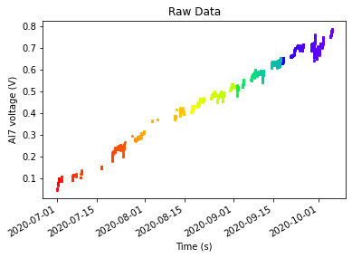

# Project Outline

A set of scripts to use machine learning to predict the non-linear (and non-sine) long term frequency drift cause by temperature changes inside the cavity in the lab. This will then be used to update a temperature control box ahead of time so that the cavity is the correct temperature at the correct time.

## Usage

Simply clone the repo and change the paths in `Scripts/predictCavityDrift.py`
As an example of code usage, I have included a set of pre-sorted cavity data in the pickled file: `cavdat_20200701-20201005`. Additionally, I have included examples of the .lvm and geography build temperature data files in the `Example LVM data` folder.
  
  
### `sortLVM.py`
This script contains functions used to take the data stored in the lvm files that the Single Atom Lab LabVIEW Interface (SALLI) generates and store it into a pandas dataframe. To save on RAM I would recommend setting `sample_period` (which defines the minimum number of seconds present between samples) to 600 (i.e. 1 sample point every 10 minutes).
An example of the data which has been pre-loaded and pickled into `cavdat_20200701-20201005` is shown below:  
  
  
### `CleanCavityDataFunctions.py`
A set of functions designed to clean and plot cavity drift data (obtained from the 1 GHz, Free Spectral Range, optical cavity) which has been extracted by `sortLVM.py`.
There are seven unique functions in this script for filtering the data:

* filterSpikes
	A function to remove voltage (frequency) jumps, which can be seen as noise in the above Figure, from the data.  
	  
	  
* fineFilter
	Applies a voltage spike filter of finer grade than filterSpikes to the data. The purpose is to remove any slow voltage changes that occur when the cavity set up is in the process of going off lock. In particular the script looks for any clusters of NaNs greater than `Nthresh` and computes the average slope of `width` points on either side of the Nan gap. If the average is greater than the `cutoff` slope then the data considered to be in the process of jumping off lock and the points used in the average are removed. For illustratory purposes the below Figure shows a fineFilter being applied to the data obatined from filterSpikes (above) using the parameters: *`Nthresh` = 100*, *`cutoff`=10e-4*, *`width`=10*.  
	  
	  
* movingFilter
	Uses a moving filter to determine the average slope across a set of *N* points (default 10). If the slope is greater than some threshold, *T*, then all of the points used in the average will be removed. The below figure illustrates this for *N=10* and *T=0.001* applied to the data returned from the filterSpikes function above.  
	  
	  
* interpolate_dayBYday
	Takes data that has jumped and shifted to a new stable point in the locking setup and shifts it back down to the next nearest collection of points. This is performed on a day by day bases because sometimes the AOM is adjusted in the morning which results in much larger shifts which we would still like to be able to see.
	  
	  
* interpolate_betweenDays
	Similar to interpolate_dayBYday, except we now only look at the differences between days. This function assumes that `interpolate_dayBYday` has already been run on the data.
	  
	  

There are also two plotting functions for displaying the data. The first `plot_dayBYday` was used to generate the above figures, highlighting each day with a different colour from within my rainbow gradient function, `rainbow_gradient` (which can be easily modified to use any kind of linear colour gradient you like), ranging from red ([255, 0, 0]) to violet ([143, 0, 255]). The second plotting function `plot_monthBYmonth` behaves similarly to YYY except that it will sperate out each month into its own subplot. Likewise, the data for each day will be displayed with a different colour within a rainbow gradient as shown below:  
  
  
  
It is worth noting that `plot_monthBYmonth` assumes that there are no nans present in the data.
  

### `PredictCavityDrift.py`
A sample script which will collect data using `sortLVM.py` if the element `load_data` in the dictionary `datadict` is set to `False`. Otherwise the script will load the pickled file found in `root` under the name dictionary's `filename` element. From there the script will apply a few of the filtering and interpolation functions from `CleanCavityDataFunctions.py`. From there the script will call several machine learning algorithms from the scikit-learn package, apply them to the data `100` times each, and choose whichever model predicts the data best (on average). The below Figure shows the result of applying these functions to the data pickled in the sample file: `cavdat_20200701-20201005`.  
  
  
  
### `RewriteCavityFiles2.m`
A MATLAB script for adding time into any .lvm file generated by SALLI prior to July the 8th 2020.
  
  
## Contributing

Pull requests are welcome. For major changes, please open an issue first to discuss what you would like to change.

## License
[MIT](https://choosealicense.com/licenses/mit/)

## Version info:
This is a list of the packages and their versions I had installed while writing these scripts:  
  
INSTALLED VERSIONS
python           : 3.8.3.final.0  
python-bits      : 64  
OS               : Windows  
OS-release       : 10  
machine          : AMD64  
processor        : Intel64 Family 6 Model 60 Stepping 3, GenuineIntel  

pandas           : 1.0.5  
numpy            : 1.18.5  
pytz             : 2020.1  
dateutil         : 2.8.1  
pip              : 20.1.1  
setuptools       : 49.2.0.post20200714  
Cython           : 0.29.21  
pytest           : 5.4.3  
sphinx           : 3.1.2  
xlsxwriter       : 1.2.9  
lxml.etree       : 4.5.2  
html5lib         : 1.1  
jinja2           : 2.11.2  
IPython          : 7.16.1  
bs4              : 4.9.1  
bottleneck       : 1.3.2  
lxml.etree       : 4.5.2  
matplotlib       : 3.2.2  
numexpr          : 2.7.1  
openpyxl         : 3.0.4  
pytest           : 5.4.3  
scipy            : 1.5.0  
sqlalchemy       : 1.3.18  
tables           : 3.6.1  
xlrd             : 1.2.0  
xlwt             : 1.3.0  
xlsxwriter       : 1.2.9  
numba            : 0.50.1  
sklearn          : 0.23.1  
